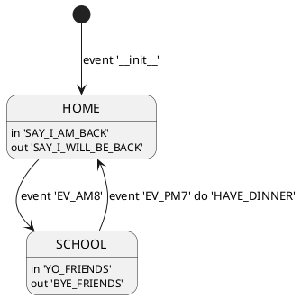

# xfsm-java


```gradle
repositories {
    jcenter()
    maven {
        url "http://dl.bintray.com/sng2c/maven"
    }
}

dependencies {
    compile 'com.mabook:xfsm:1.1.5'
}
```

## plantuml format




## json format

```json
{
    "initialEvent": "__init__",
    "states": {
        "HOME": {
            "name": "HOME",
            "onEnter": "SAY_I_AM_BACK",
            "onExit": "SAY_I_WILL_BE_BACK"
        },
        "SCHOOL": {
            "name": "SCHOOL",
            "onEnter": "YO_FRIENDS",
            "onExit": "BYE_FRIENDS"
        }
    },
    "transitions": {
        "EV_AM8@HOME": {
            "event": "EV_AM8",
            "fromStateName": "HOME",
            "toStateName": "SCHOOL"
        },
        "__init__": {
            "event": "__init__",
            "toStateName": "HOME"
        }
    }
}
```

