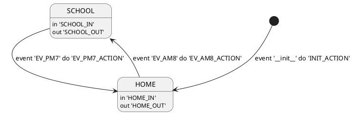

# xfsm-java

## install

```gradle
repositories {
    jcenter()
    maven {
        url "http://dl.bintray.com/sng2c/maven"
    }
}

dependencies {
    compile 'com.mabook:xfsm:1.1.8'
}
```


## xfsm dsl

```
BEGIN_STATE
- HOME
- SCHOOL
END_STATE

BEGIN_EVENT
- EV_AM8 HOME SCHOOL
- EV_PM7 SCHOOL HOME
END_EVENT
```


## plantuml format




## json format

```json
{
   "initialEvent":"__init__",
   "states":{
      "SCHOOL":{
         "name":"SCHOOL",
         "onEnter":"SCHOOL_IN",
         "onExit":"SCHOOL_OUT"
      },
      "HOME":{
         "name":"HOME",
         "onEnter":"HOME_IN",
         "onExit":"HOME_OUT"
      }
   },
   "transitions":{
      "EV_PM7@SCHOOL":{
         "event":"EV_PM7",
         "fromStateName":"SCHOOL",
         "toStateName":"HOME",
         "onTransition":"EV_PM7_ACTION"
      },
      "EV_AM8@HOME":{
         "event":"EV_AM8",
         "fromStateName":"HOME",
         "toStateName":"SCHOOL",
         "onTransition":"EV_AM8_ACTION"
      },
      "__init__":{
         "event":"__init__",
         "toStateName":"HOME",
         "onTransition":"INIT_ACTION"
      }
   }
}
```

## See also

https://gist.github.com/sng2c/afca55a5a14aed2c26f6
