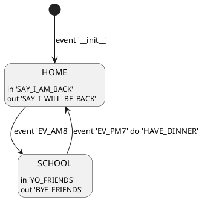

# xfsm-java


```gradle
repositories {
    jcenter()
    maven {
        url "http://dl.bintray.com/sng2c/maven"
    }
}

dependencies {
    compile 'com.mabook:xfsm:1.1.5'
}
```

## plantuml format




## json format

```json
{
    "states": {
        "hello": {
            "name": "hello",
            "onEnter": "say hello",
            "onExit": "say bye"
        },
        "init": {
            "name": "init",
            "onEnter": "at home",
            "onExit": "at street"
        }
    },
    "transitions": {
        "__init__": {
            "event": "__init__",
            "toStateName": "init"
        },
        "go home@hello": {
            "event": "go home",
            "fromStateName": "hello",
            "toStateName": "init",
            "onTransition": "take a bus"
        },
        "go out@init": {
            "event": "go out",
            "fromStateName": "init",
            "toStateName": "hello",
            "onTransition": "take a taxi"
        }
    },
    "initialEvent": "__init__"
}
```

